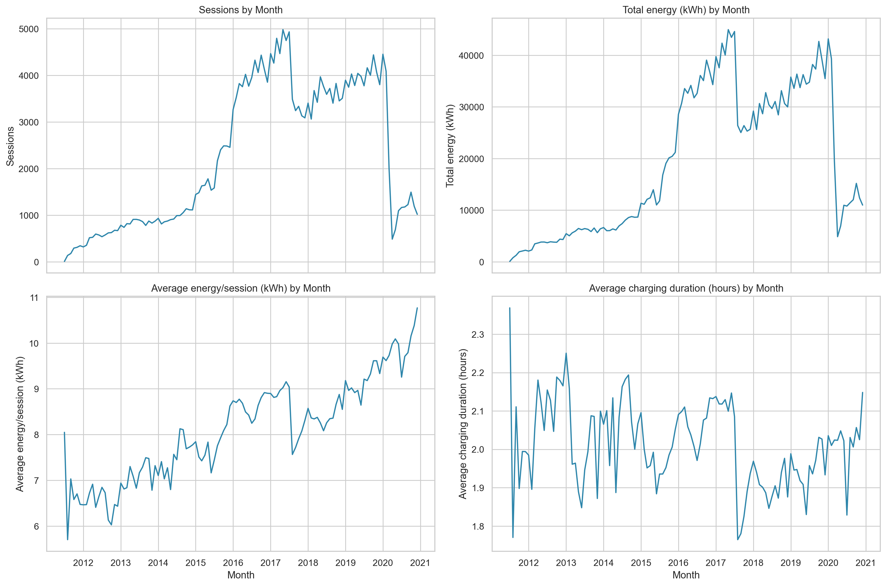

# Electric Vehicle Charging Station Usage Analysis

An exploratory data analysis of electric vehicle charging behavior in Palo Alto, California. The project examines when chargers are used, how demand changed over time, differences among stations, the relationship between charging duration and energy delivered, and post-charging idle time.



## Project overview

The analysis uses the City of Palo Alto's Electric Vehicle Charging Station Usage dataset covering July 2011 through December 2020. The source data contains 259,415 charging sessions across 47 stations. After removing 120 duplicate or objectively invalid records, 259,295 sessions remained for analysis.

The project includes a complete Jupyter notebook, generated charts and summary tables, and reports in PDF and Word formats.

## Key findings

- Charging sessions most often began at 11:00, and Wednesday was the busiest day.
- Weekdays accounted for 76.1% of all sessions.
- The dataset records 2,215,029 kWh of energy, averaging 8.54 kWh per session.
- Charging duration and energy delivered were strongly correlated (`r = 0.871`).
- The busiest observed year was 2017, with 48,950 sessions.
- The busiest station was `PALO ALTO CA / HAMILTON #2`, with 23,706 sessions.
- Average idle time was 0.49 hours, and 12.1% of sessions had at least one hour of idle time.
- Weekend sessions used 7.6% less energy and had 14.5% less charging time on average than weekday sessions.

These findings are descriptive. The observational data does not establish causal relationships.

## Repository contents

| Path | Description |
| --- | --- |
| `EV_Charging_Analysis.ipynb` | Complete data cleaning, analysis, visualization, and interpretation |
| `EVChargingStationUsage.csv` | Original source dataset |
| `PROJECT_RESULTS.md` | Concise written summary of methods and findings |
| `figures/` | Charts generated by the analysis |
| `outputs/` | Aggregated analysis tables |
| `Complete_EV_Charging_Analysis_Report.pdf` | Complete project report in PDF format |
| `Complete_EV_Charging_Analysis_Report.docx` | Editable Word version of the complete report |
| `build_notebook.py` | Script used to generate the Jupyter notebook |
| `create_complete_report.py` | Script used to generate the Word report |
| `create_pdf_report.py` | Script used to generate the PDF report |

The full cleaned dataset is generated locally as `outputs/cleaned_ev_charging_data.csv`. It is excluded from Git because its size exceeds GitHub's per-file limit.

## Analysis workflow

1. Inspect the dataset structure, data types, missing values, and duplicate records.
2. Parse timestamps and durations and remove objectively invalid sessions.
3. Engineer time, season, station, energy, duration, and idle-time features.
4. Analyze hourly, daily, monthly, seasonal, and station-level usage.
5. Evaluate outliers and correlations without automatically discarding valid extremes.
6. Export reusable summary tables, figures, and reports.

## Getting started

Clone the repository and enter the project directory:

```bash
git clone https://github.com/Noorulislam1/Data-Science-Project-.git
cd Data-Science-Project-
```

Create a virtual environment and install the required packages:

```bash
python3 -m venv .venv
source .venv/bin/activate
python3 -m pip install jupyter pandas numpy matplotlib seaborn scipy scikit-learn nbformat python-docx reportlab
```

Launch the analysis notebook:

```bash
jupyter notebook EV_Charging_Analysis.ipynb
```

Run all notebook cells to reproduce the cleaned data, summary tables, figures, and findings. To rebuild the notebook or reports from their source scripts, use:

```bash
python3 build_notebook.py
python3 create_complete_report.py
python3 create_pdf_report.py
```

## Data limitations

- The data represents one geographic area and charging-network context.
- Station inventory and operating policies may have changed during the study period.
- The first year is partial, covering six months of 2011.
- Missing descriptive fields and logging anomalies remain possible.
- The dataset does not directly measure queues, unmet demand, trip purpose, or battery state of charge.
